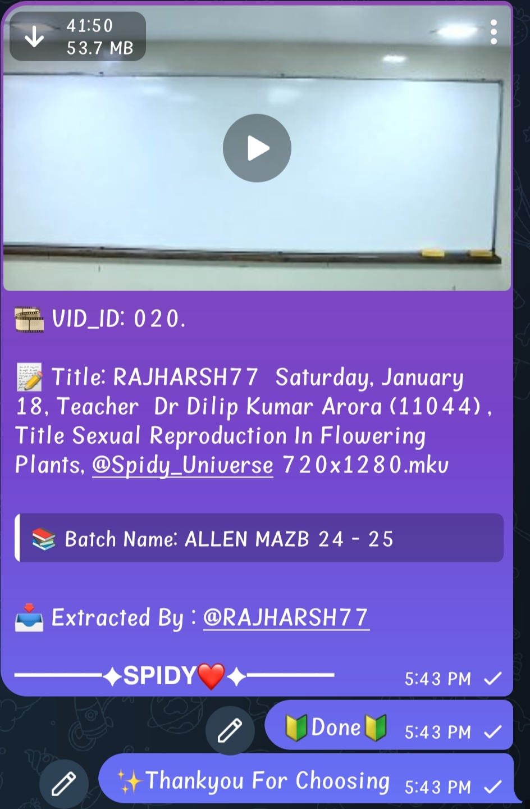
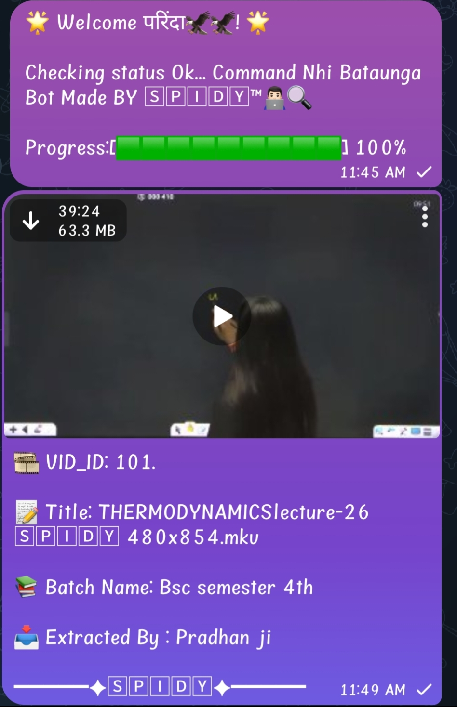

<p align="center">
  
</p>

<h1 align="center">
  
</h1>

---

### **Features**
- Convert your txt into video 
- Working fine for pw, appx and classplus txt
- Multiple modes & custom output options
- Supports `/upload`, `/advance`, `/spidy`, and more

---

### **Bot Commands**
```
/start       - Run bot
/stop        - Stop ongoing task
/upload      - For using in groups
/advance     - Advance download
/spidy       - All types txt
/alpha       - Much better
/bravo       - Another one
```

---

### 🚀 Deploy to Render

#### **1-Click Deploy:**
[](https://render.com/deploy?repo=https://github.com/yourusername/TXT-TO-VIDEO)

#### **Manual Setup on Render:**
```bash
1. Fork the repo
2. Go to https://dashboard.render.com
3. Click "New Web Service"
4. Connect GitHub and select your repo
5. Set build command: pip install -r requirements.txt
6. Set start command: python3 bot.py
7. Add environment variables: API_ID, API_HASH, BOT_TOKEN, etc.
8. Click "Deploy"
```

---

### 🖥️ Run on VPS
```bash
# Update system and install dependencies
sudo apt update && sudo apt install git python3-pip -y

# Clone the repo
git clone https://github.com/popeye68/TXT-TO-VIDEO
cd TXT-TO-VIDEO

# Install requirements
pip3 install -r requirements.txt

# Export environment variables or add them in config.py
export API_ID=123456
export API_HASH=your_api_hash
export BOT_TOKEN=your_bot_token

# Run the bot
python3 bot.py
```
---

### 📸 Screenshots
<p align="center">
  
  
</p>

---

### ⚡ Feel Free to Fork and Customize
This project is open source — you're welcome to change or enhance it after forking.

---

### Connect with us
<p align="center">
  <a href="https://t.me/spidy_bots">
    
  </a>
</p>

<p align="center">
  
  
</p>
